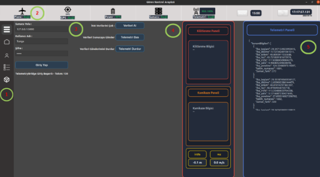
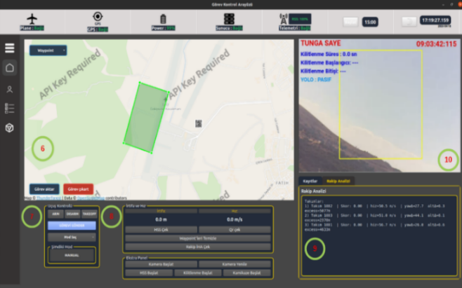

# TUNGA Ground Control Station

A custom **Qt/C++ Ground Control Station (GCS)** developed for the TUNGA UAV system for the **TEKNOFEST Fighting UAV Competition (Savaşan İHA)**.

The application provides a unified interface for UAV monitoring, telemetry, mission execution, camera visualization, map-based tracking, autonomous task control, simulation and communication with the competition server.

## Features

- Real-time UAV telemetry monitoring
- Map-based UAV position and heading visualization
- Flight mode and mission control
- Waypoint and altitude management
- Camera and video stream integration
- Lock-on and autonomous mission control
- Competition server communication
- Rival UAV tracking and analysis with concurrent telemetry and map visualization for approximately **40 aircraft**
- Telemetry transmission and reception
- Simulation support
- Mission checklist interface

## Interface Overview

The TUNGA Ground Control Station combines UAV telemetry, mission control,
competition-server communication and real-time visualization in a single
operator interface.

### Server & Telemetry Panel



The communication panel provides:

- **[1] Navigation:** Access to the main GCS modules.
- **[2] System Status:** UAV connection, GPS, battery, server and telemetry status.
- **[3] Competition Server:** Authentication and telemetry transmission to the competition server.
- **[4] Mission Status:** Lock-on and kamikaze mission information.
- **[5] Telemetry Monitor:** Real-time telemetry data for the team's UAV and rival UAVs.

### Mission Control Interface



The primary mission interface includes:

- **[6] Map:** Waypoint management, mission upload/download and real-time visualization of UAVs and mission areas.
- **[7] Flight Control:** Arm, disarm, takeoff and flight-mode control.
- **[8] Mission Panel:** Altitude, speed and controls for autonomous mission modules such as HSS, lock-on and kamikaze tasks.
- **[9] Analysis Panel:** Runtime logs and rival UAV analysis.
- **[10] Target Lock View:** Camera visualization, lock region and mission-related target information.

## Technologies

- **C++17**
- **Qt 6.9.1**
- **Qt Widgets**
- **Qt Quick / QML**
- **ROS Noetic**
- **roscpp**
- **OpenCV**
- **Linux / Ubuntu 20.04**

## Project Structure

```text
TUNGA_Ground_Control_Station/
├── LoginPage/          # Main integrated GCS application
├── MainPage/           # Ground control interface development module
├── CheckListPage/      # Mission checklist module
├── SimulasyonPage/     # Simulation interface
├── package.xml         # ROS package metadata
├── .gitignore
└── README.md
```

The main application entry point is:

```text
LoginPage/LoginPage.pro
```

## System Overview

The Ground Control Station combines several UAV subsystems in a single operator interface:

```text
UAV / Autopilot
      │
      ▼
ROS Telemetry
      │
      ▼
TUNGA Ground Control Station
 ├── Map & UAV Tracking
 ├── Camera / Video
 ├── Flight Controls
 ├── Mission Management
 ├── Rival UAV Analysis
 ├── Simulation
 └── Competition Server
```

## Requirements

The project was developed and tested using:

```text
Ubuntu 20.04
ROS Noetic
Qt 6.9.1
GCC
qmake
OpenCV
```

Make sure ROS Noetic and Qt are correctly installed before building the project.

## Build and Run

Clone the repository and enter the project directory:

```bash
git clone https://github.com/bochra39/TUNGA_Ground_Control_Station.git
cd TUNGA_Ground_Control_Station
```

Load the ROS environment:

```bash
source /opt/ros/noetic/setup.bash
```

Create a separate build directory:

```bash
REPO_DIR="$(pwd)"

mkdir -p /tmp/tunga_gcs_build
cd /tmp/tunga_gcs_build

qmake "$REPO_DIR/LoginPage/LoginPage.pro"
make -j$(nproc)

./LoginPage
```

> Ensure that `qmake` refers to the Qt 6 installation used by the project.

## Repository Notes

Runtime logs, telemetry logs, IDE caches, downloaded binaries and generated build files are excluded from the public repository where possible.

The repository primarily contains the source code and resources required to document and continue development of the TUNGA Ground Control Station.

## Project Context

This system was developed as part of the **TUNGA UAV project** to support UAV operations during competitive autonomous flight scenarios.

The interface was designed to bring together telemetry, UAV control, mission execution, target tracking, visualization and competition-server communication within a single ground station environment.

## Status

The repository contains the developed TUNGA Ground Control Station software and is maintained for portfolio, documentation and future development purposes.
